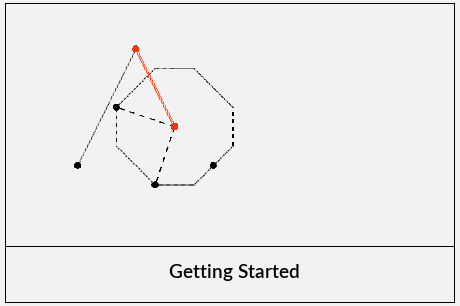
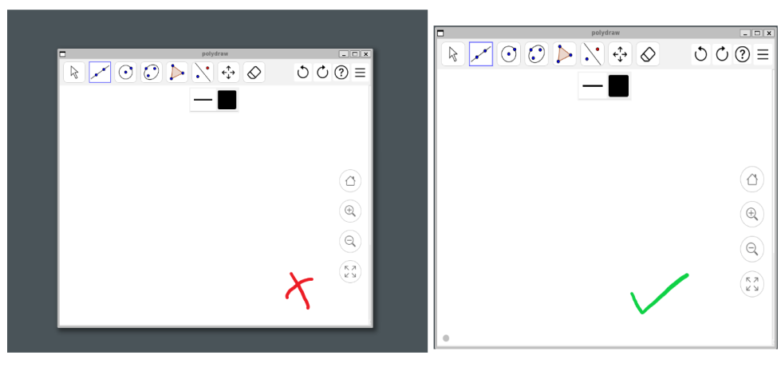

# Creating a new tutorial

- [Creating a new tutorial](#creating-a-new-tutorial)
  - [Setup](#setup)
  - [Add preview image](#add-preview-image)
  - [Add keywords](#add-keywords)
  - [Recording GIF](#recording-gif)
  - [Writing tutorial](#writing-tutorial)
    - [Presets](#presets)
    - [Using StyledDocument](#using-styleddocument)
    - [Using a custom layout](#using-a-custom-layout)

You can add/modify a tutorial in the tutorial center screen by following the instructions defined in this document.

## Setup

1. In `view/tutorial`, create a new class that extends `TutorialPanel`. A minimal template for a tutorial is as follows:

   ```java
   package com.github.creme332.view.tutorial;

   import static com.github.creme332.utils.IconLoader.loadIcon;
   import static com.github.creme332.utils.IconLoader.getScaledDimension;

   import java.awt.Dimension;

   import com.github.creme332.model.TutorialModel;
   import com.github.creme332.utils.exception.InvalidIconSizeException;
   import com.github.creme332.utils.exception.InvalidPathException;

   public class DrawCircleTutorial extends TutorialPanel {

       private static final String IMAGE_PATH_PREFIX = "/images/tutorials/draw-circle/";
       private static final TutorialModel DRAW_CIRCLE_MODEL = new TutorialModel("Draw Circle");

       public DrawCircleTutorial() throws InvalidPathException, InvalidIconSizeException {
           super(DRAW_CIRCLE_MODEL, loadIcon(IMAGE_PATH_PREFIX + "background.png",
                   getScaledDimension(new Dimension(1291, 616), TutorialCard.IMAGE_DIMENSION)));
       }
   }
   ```

2. Define a static constant for your `TutorialModel`. A `TutorialModel` stores some general information about a tutorial such as its title.
3. In `resources/images/tutorials`, create a new folder where you will store your assets. An asset can be a GIF or an image.
4. Define `IMAGE_PATH_PREFIX` in your class to point to your newly created folder. This prefix will make it easier to write and modify the file location of assets in the tutorial.
5. In `view/TutorialCenter.java`, modify `initTutorialScreens()` to add your newly created tutorial to the `tutorialScreens`. Without this step, your tutorial will not appear in the tutorial center.

## Add preview image

A preview image is an image that appears in a tutorial card on the tutorial center screen:



To add/modify a preview image for a tutorial, place the preview image in the assets folder belonging to the tutorial. The image can be named `background.png`.

  ```java
      public DrawCircleTutorial() throws InvalidPathException, InvalidIconSizeException {
        super(DRAW_CIRCLE_MODEL, loadIcon(IMAGE_PATH_PREFIX + "background.png", TutorialCard.IMAGE_DIMENSION));
    }
  ``` 

> [!IMPORTANT]
> Ensure that your image has a dimension of **450x300** to prevent distortions. If your image dimension is incorrect, you will see a red background around your image.

## Add keywords

To improve the discoverability of your tutorial when the search bar is used on the tutorial center, it is recommended to define add some keywords to your `TutorialModel`. These keywords are words that users will typically use when searching the tutorial.

For example, if a user might search for `dda` to find the tutorial on drawing lines using with the DDA line algorithm:

```java
// inside constructor of tutorial view
model.addKeyword("dda");
```

> [!WARNING]
> There is no need to add the title of the tutorial itself as keywords as words in the title are automatically used as keywords during searching. 

## Recording GIF

You can create GIFs for your tutorial to make it easier to understand. Here are some general guidelines for creating GIFs:
- The recommended method for recording GIFs is to use the open-source [ScreenToGif](https://www.screentogif.com/) application.
- When selecting the area to record, ensure that the entire frame is visible and that **your desktop background should not be visible**.
    
- Disable guidelines and axes in the canvas settings of Polydraw because it does not look good when the GIF is resized in the application.
    
- Try to keep your GIFs under 1 minute. If they exceed 1 minute, speed up the GIF in the ScreenToGif application itself.

## Writing tutorial

### Presets

Tutorials extending the `TutorialPanel` class have access to the following variables which you should use when writing the tutorial:
- a `JTextPane` called `textPane`.
- a StyledDocument for `textPane` called `doc`. The document is using center alignment for paragraphs.
- styles: `defaultStyle`, `regular`, `bold`, `italic`.

Tutorials extending the `TutorialPanel` class will automatically have a header panel containing a functional back button and the tutorial title:


If you have not added any Swing component to the StyleDocument, the tutorial will be **scrollable as well**.

### Using StyledDocument

To insert `regular` text to the document:

```java
doc.insertString(doc.getLength(), "My first line.\n\n", regular);
```

To insert an image to the document:

```java
ImageIcon icon = loadIcon(IMAGE_PATH_PREFIX + "draw-line.gif", new Dimension(1000, 593));
StyleConstants.setIcon(imageStyle, icon);
doc.insertString(doc.getLength(), " ", imageStyle);
```

To insert a component to the `textPane`:

```java
JButton button = new JButton("Click Me!"); 
button.addActionListener(new ActionListener() { 
    @Override
    public void actionPerformed(ActionEvent e) 
    { 
      // do something
    } 
}); 
textPane.insertComponent(button); 
```

### Using a custom layout

Using the StyledDocument approach given above is the easiest way to write a simple tutorial. However, if you want more flexibility, you can avoid the use of JTextPane and define your own layout (e.g. using GridBagLayout).

> [!TIP]
> See the code for the Getting Started tutorial for an example.

If you want to use a custom layout for your tutorial instead of the default one, you should add the following lines to the **constructor of your tutorial**:

```java
// remove bodyPanel since default layout is not being used
this.remove(bodyPanel);

// define your content and layout in a component
JPanel mainPanel = new JPanel();
// ... add other components to your mainPanel

// add your panel to the screen so that it appears at the center
this.add(mainPanel, BorderLayout.CENTER);
```


> [!IMPORTANT]
> Despite creating your own `mainPanel` you will still have a functional header panel with back button and title.